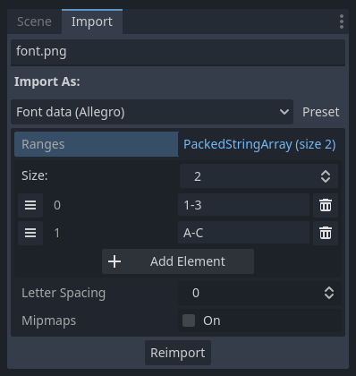

# gabfip

Godot Allegro Bitmap Font Importer Plugin. Requires Godot 3.2+.

This provides an importer for [BitmapFont](https://docs.godotengine.org/en/3.2/classes/class_bitmapfont.html) resources from plain PNG images, similarly to [Allegro](https://liballeg.org/)'s [`al_grab_font_from_bitmap`](https://liballeg.org/a5docs/trunk/font.html#al_grab_font_from_bitmap) function.

This allows you to create bitmap fonts in a normal image editor, which is particularly useful for pixel fonts and such. No [BMFont](https://www.angelcode.com/products/bmfont/) required.

## Image format

> Note: this is heavily adapted from [Allegro's documentation](https://liballeg.org/a5docs/trunk/font.html#al_grab_font_from_bitmap).

Let's explain this by example. Here's a valid (albeit tiny) PNG which specifies a 5x5 pixel font for the glyphs `A` to `F`:


Now, let's look at how the importer interprets it:

```
......................
.AAAAA .BBBB  .CCCCC .
.A   A .B   B .C     .
.AAAAA .BBBBB .C     .
.A   A .B   B .C     .
.A   A .BBBBB .CCCCC .
......................
.DDDD  .EEEEE .FFFFF .
.D   D .E     .F     .
.D   D .EEEE  .FFFF  .
.D   D .E     .F     .
.DDDDD .EEEEE .F     .
......................
```

* Each '`.`' in the above is a **background colour** pixel. The top-leftmost pixel defines this colour, and every **outside pixel** in the image must be the background colour.
  * In the PNG above, the background colour is mid-grey (`#7f7f7f`).
  * This **shouldn't be transparent** (see the below note).
* Glyphs can vary in width, but must be the **same height**.
* Every row of glyphs must be separated by a horizontal line with the background colour.
* Glyphs are added without spacing, so if you want that, you'll need to add it to the end of each character.
  * You'll notice we've done that above.
  * I'm aware that `BitmapFont` provides this facility, but as it stands, the importer just replicates Allegro's functionality. More bells and whistles of this variety may be added in future.
* It's fine to put more than 1 vertical line of the background colour between glyphs.

> Note: contrary to the above PNG, you'll generally want to make the glyphs themselves a transparent background - or they'll be drawn opaque. (we've just used a black background so you can see it on the page!)

Even with all of the above, the importer still doesn't know which glyphs correspond to which characters. This leads us onto...

## Plugin options

Select a PNG image in the 'FileSystem' tab, then select the 'Import' tab.

Then, select 'BitmapFont (Allegro)' from the dropdown:



Each pair of characters in 'Ranges' defines an **inclusive** range of glyphs to import from the image. So, in the above example, `A` to `F` are imported - meaning this'd correctly import the example font from the previous section.

> Note: apologies, I'm aware this is a bit janky. It doesn't seem possible to provide property hints for importer options at the moment.

Once everything's configured, hit 'Reimport'. Hopefully, that should be it, and you can now use your PNG as a font!

Keep an eye on the console for errors; if the image isn't correctly formatted - or your the number of glyphs specified doesn't match it - you'll be warned about it there.

## License

[MIT](./LICENSE)
